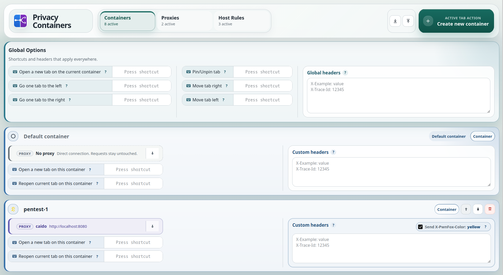
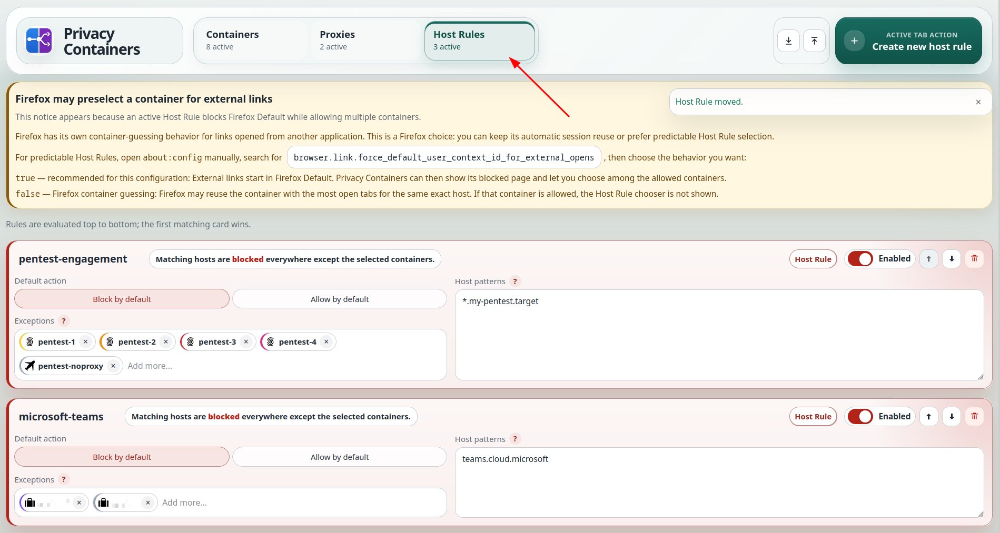
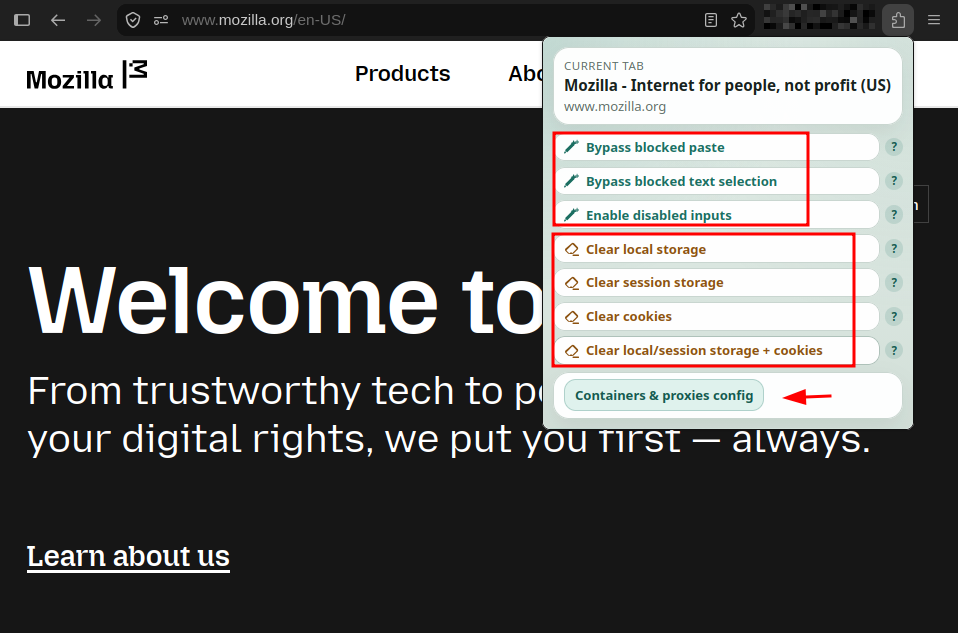

# Privacy Containers

**Per-container proxy routing, request controls, and shortcuts for Firefox.**

Privacy Containers is a Firefox extension for web testing and multi-account
work. Each container gets its own route, headers, and access rules.

Route a client session through an intercepting proxy, keep another account
direct, and leave everyday browsing untouched—all in the same Firefox window.

https://addons.mozilla.org/addon/privacy-containers/

## What it does

- Routes each container directly or through reusable HTTP, HTTPS, or SOCKS
  proxies, with remote DNS, HTTP/HTTPS authentication, and proxy bypass rules
  when needed.
- Shows at a glance whether the current tab is using a proxy.
- Adds request headers globally or per container, including the
  PwnFox-compatible `X-PwnFox-Color` header.
- Uses Host Rules to keep selected hosts in the right containers. A blocked
  link can be reopened directly in an allowed one.
- Opens or reopens tabs in a chosen container, with configurable shortcuts for
  switching, moving, and pinning tabs.
- Imports and exports its configuration as JSON.

## Useful tools in the popup

The toolbar popup can also fix common page annoyances without opening DevTools:

- bypass blocked paste and text selection;
- re-enable disabled form fields;
- clear local storage, session storage, or cookies for the current page.

## Get started

1. Open **Containers & proxies config** from the toolbar popup.
2. Create or reuse a Firefox Container and assign a proxy if it needs one.
3. Open a tab in that container. Its route applies immediately.

Add headers, Host Rules, or shortcuts only when you need them.

## Privacy

There is no account, telemetry, cloud service, or remotely loaded code. Settings
stay in Firefox, and only containers you assign to a proxy use it.

## Requirements and license

Requires desktop Firefox 142 or later with Firefox Containers enabled.

Released under the [Mozilla Public License 2.0](LICENSE).
